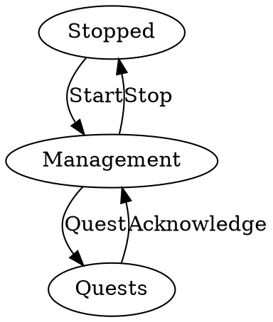
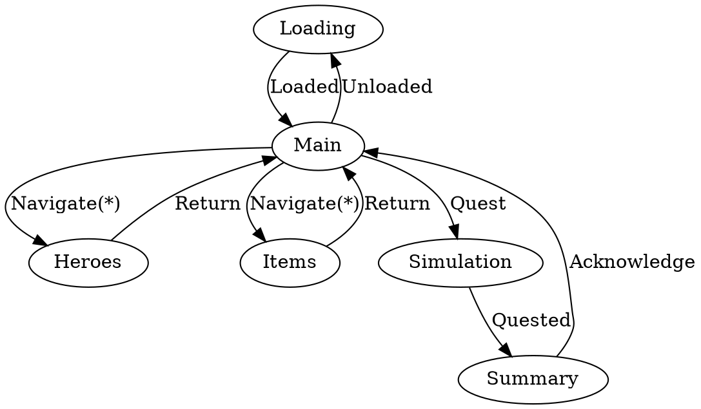

# States

## Game State

### States
* Stopped
  * Description: Resources are unloaded.
* Management
  * Description: Resources are loaded and managable.
* Quests
  * Description: Resources are locked and simulation runs.

### Transitions
* Start
  * Source: `Stopped`
  * Target: `Management`
  * Event: `Start` `DataDir="./Data"`
  * Action: `Load(msg.DataDir)`
  * Description: Loads all the data and starts the simulation.
* Stop
  * Source: `Management`
  * Target: `Stopped`
  * Event: `Exit`
  * Action: `Exit()`
  * Description: Unloads all the data and stops the simulation.
* Quest
  * Source: `Management`
  * Target: `Quests`
  * Event: `Quest` `Assignments={Quest0=[Heroe0,...],...}`
  * Action: `Simulate(Assignments)`
  * Description: Player manages the guild.
* Acknowledge
  * Source: `Quests`
  * Target: `Management`
  * Event: `Acknowledge` `Results={Quest0=Result0,...}`
  * Action: `Apply(Results)`
  * Description: Simulation runs.

## Display State

### States
[HW]

### Transitions
[HW]

### Views
* Loading
  * Splash + Progress
* Main 
  * Navigation + Quest Buttons
  * Quest Log
  * Guild Params
* Hero
  * Heroes owned
  * Heroes available
  * Edit Hero Items
* Item
  * Items Owned
* Simulation
  * Text overview
* Summary
  * Hero changes
  * Item changess

## Menu Layer State

[HW]