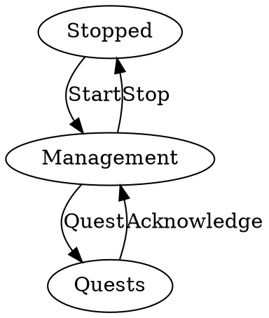
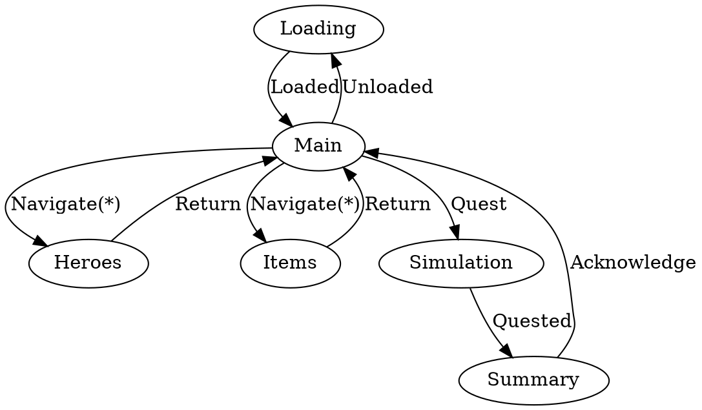
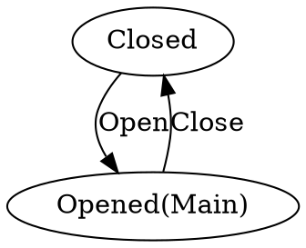

# States

## Game State

### States
* Stopped
  * Description: Resources are unloaded.
* Management
  * Description: Resources are loaded and managable.
* Quests
  * Description: Resources are locked and simulation runs.

### Transitions
* Start
  * Source: `Stopped`
  * Target: `Management`
  * Event: `Start` `DataDir="./Data"`
  * Action: `Load(msg.DataDir)`
  * Description: Loads all the data and starts the simulation.
* Stop
  * Source: `Management`
  * Target: `Stopped`
  * Event: `Exit`
  * Action: `Exit()`
  * Description: Unloads all the data and stops the simulation.
* Quest
  * Source: `Management`
  * Target: `Quests`
  * Event: `Quest` `Assignments={Quest0=[Heroe0,...],...}`
  * Action: `Simulate(Assignments)`
  * Description: Player manages the guild.
* Acknowledge
  * Source: `Quests`
  * Target: `Management`
  * Event: `Acknowledge` `Results={Quest0=Result0,...}`
  * Action: `Apply(Results)`
  * Description: Simulation runs.

## Display State

### States
* Main
  * Description: Main game screen
* Loading 
  * Description: Loading screen
* Heroes
  * Description: Hero management screen
* Items
  * Description: Inventory screen
* Simulation
  * Description: Quest process screen
* Summary
  * Description: Results screen

### Transitions
* Loaded
  * Source: `Loading`
  * Target: `Main`
  * Event: `word`
  * Action: `word`
  * Description: Exit loading screen
* Unloaded
  * Source: `Main`
  * Target: `Loading`
  * Event: `word`
  * Action: `word`
  * Description: Enter loading screen
* Navigate(Heroes)
  * Source: `Main`
  * Target: `Heroes`
  * Event: `word`
  * Action: `word`
  * Description: Open hero management screen
* Return(Heroes)
  * Source: `Heroes`
  * Target: `Main`
  * Event: `word`
  * Action: `word`
  * Description: Return to main screen
* Navigate(Items)
  * Source: `Main`
  * Target: `Items`
  * Event: `word`
  * Action: `word`
  * Description: Open items management screen
* Return(Items)
  * Source: `Items`
  * Target: `Main`
  * Event: `word`
  * Action: `word`
  * Description: Close items management screen
* Acknoledge
  * Source: `Summary`
  * Target: `Main`
  * Event: `word`
  * Action: `word`
  * Description: Update data by results
* Quest
  * Source: `Main`
  * Target: `Simulation`
  * Event: `word`
  * Action: `word`
  * Description: Begin quest simulation
* Quested
  * Source: `Simulation`
  * Target: `Summary`
  * Event: `word`
  * Action: `word`
  * Description: Resolve quest simulation

### Views
* Loading
  * Splash + Progress
* Main 
  * Navigation + Quest Buttons
  * Quest Log
  * Guild Params
* Hero
  * Heroes owned
  * Heroes available
  * Edit Hero Items
* Item
  * Items Owned
* Simulation
  * Text overview
* Summary
  * Hero changes
  * Item changess

## Menu Layer State

### States
* Opened(Main)
  * Description: Display menu
* Closed
  * Description: Hide menu

### Transitions
* Open
  * Source: `Closed`
  * Target: `Opened(Main)`
  * Event: `word`
  * Action: `word`
  * Description: Open the menu
* Close
  * Source: `Opened(Main)`
  * Target: `Closed`
  * Event: `word`
  * Action: `word`
  * Description: Close the menu

### Views
* Loading
  * Splash + Progress
* Opened(Main)
  * Main menu:
    * Start New Game Button
    * Resume Current Game Button
    * Settings Button
    * Exit Program Button

